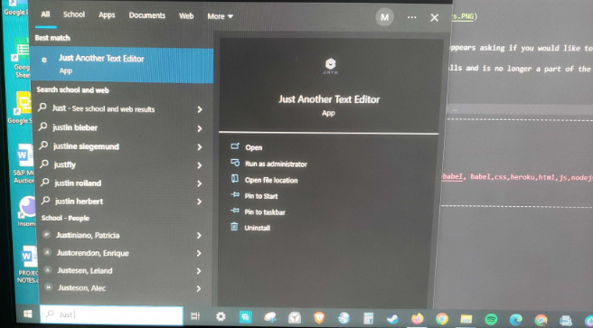

# Text-Editor-PWA

## Description 

This is "Just Another Text Editor", a web-based text editor using javascript as well as Webpack and Babel.

---------------------------------------------------------------------------------------------------------------------------------------------

[Check out the site live here!](https://t-text-editor.herokuapp.com/ )

-------------------------------------------------------------------------------------------------------------------------------------------------------------------------------------------

If you have found this blog outside of GitHub and wish to view the original, [visit my Repository link here.](https://github.com/tdusenbury/Text-Editor-PWA)

-------------------------------------------------------------------------------------------------------------------------------------------------------------------------------------------

-------------------------------------------------------------------------------------------------------------------------------------------------------------------------------------------

## Technology Used 

|  

-------------------------------------------------------------------------------------------------------------------------------------------------------------------------------------------

## Table of Contents

  - [**Description**](#description)
  - [**Usage**](#usage)
  - [**Author Info**](#author-info)
  - [**License**](#license)

-------------------------------------------------------------------------------------------------------------------------------------------------------------------------------------------
## Usage 

The below image shows that when the site loads, you are given a basic text editing page with a button to "Install"!

You can input your text above or below and it is saved. This picture also shows that no errors are being reported in the console.

When you click the `Install` button, an alert appears asking if you would like to install the application.

If you choose to install, the application installs and is no longer a part of the browser.

Close the application, then use the search bar to recall the application. 

When you open it again, the previously notes will be available.

-------------------------------------------------------------------------------------------------------------------------------------------------------------------------------------------

## Author Info
My name is Tamara "T" Dusenbury
If you have any questions about me or this project, please contact me:
  
- [**Github**](https://github.com/tdusenbury)

- [**LinkedIn**](https://linkedin.com/in/tamara-dusenbury-02ab8591)

- [**Email**](mailto:tamara.dusenbury@gmail.com)

-------------------------------------------------------------------------------------------------------------------------------------------------------------------------------------------
## Credits

Thank you to my fabulous cohort and all the wonderful TAs!!

-------------------------------------------------------------------------------------------------------------------------------------------------------------------------------------------

## Contributing

If you would like to contribute, please follow the [Contributor Covenant](https://www.contributor-covenant.org/).

-------------------------------------------------------------------------------------------------------------------------------------------------------------------------------------------

## License

This projects holds an MIT License.